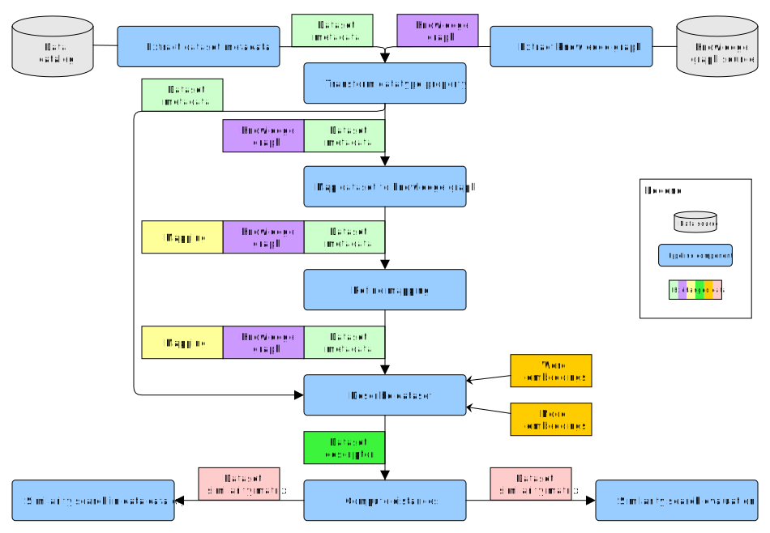

# SimPipes Components
Repository for SimPipes components, implementations usable in the context of the following similarity pipeline conceptual model.

The repository is structured according to conceptual component types:

- [Metadata extractors](metadata-extractors)
- [Knowledge graph extractors](knowledge-graph-extractors)
- [Dataset to knowledge graph mappers](dataset-to-knowledge-graph-mappers)
- [Mapping refiners](mapping-refiners)
- [Dataset describers](dataset-describers)
- [Distance computers](distance-computers)